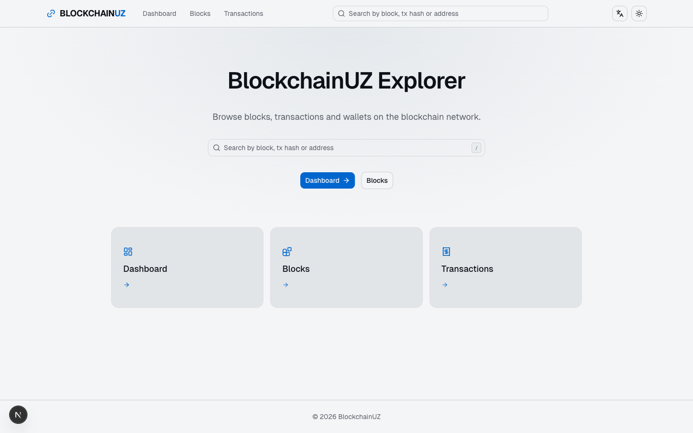
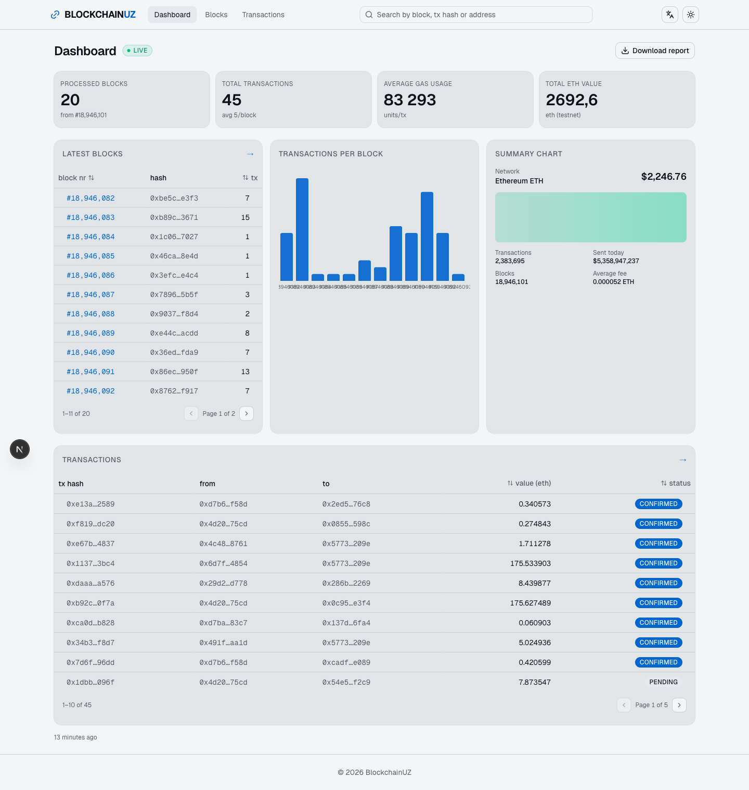
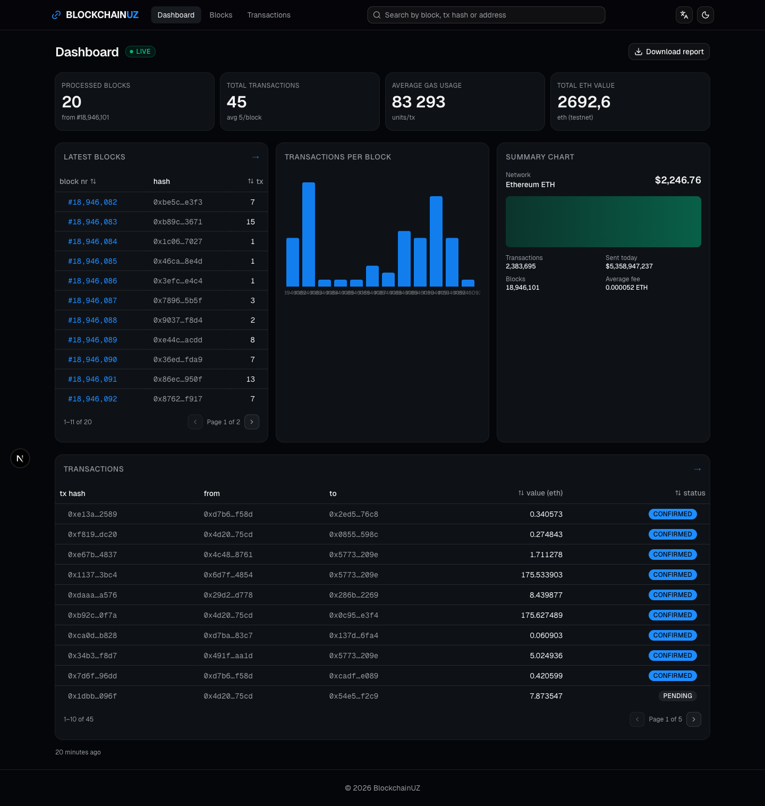
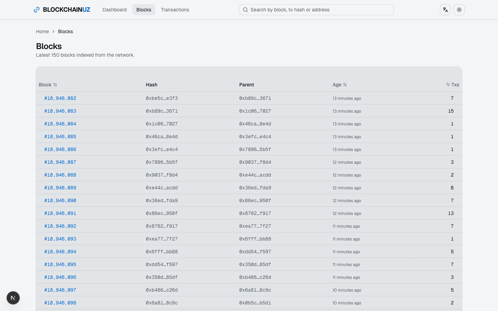
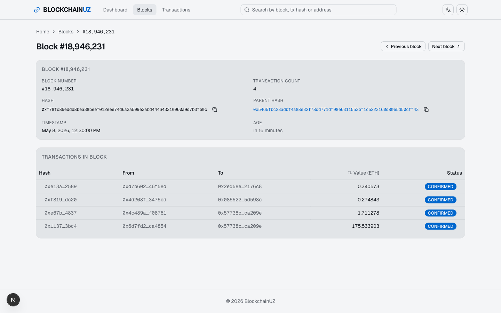
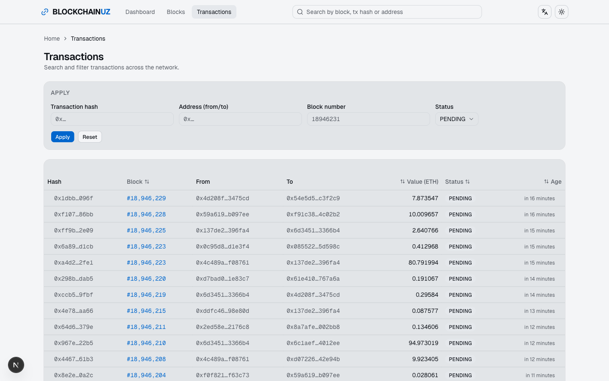
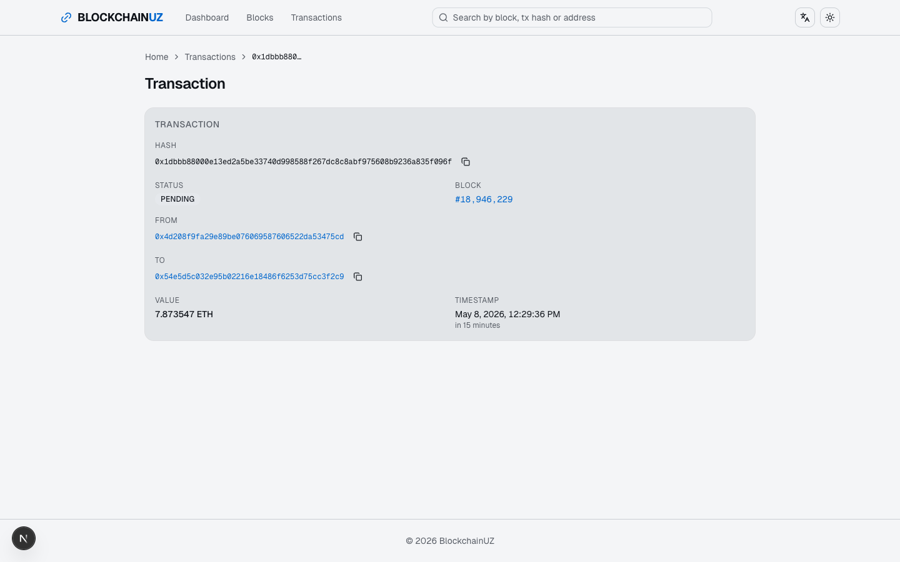
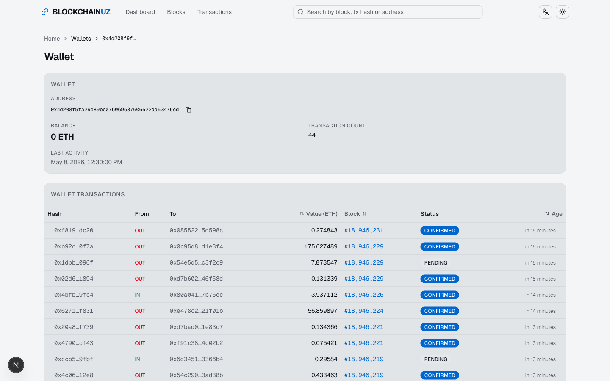
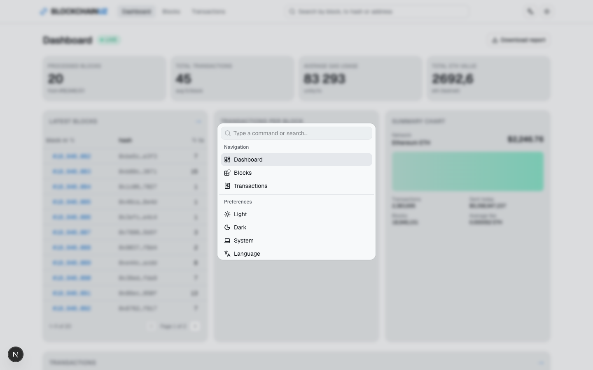

# BlockchainUZ — Frontend

Enterprise-grade blockchain explorer for the BlockchainUZ project: dashboards, block and
transaction browsing, wallet lookups, deep linking, and a smart global search — all running
against an API mock so the frontend is fully demoable without the backend.

Built with **Next.js 16** (App Router + Turbopack), **React 19**, **TypeScript 5**,
**Tailwind v4**, **shadcn/ui** on top of **Base UI**, **next-intl** (pl/en), **Recharts**
and **MSW** (Mock Service Worker).

> Monorepo siblings:
> - Backend: [`../BlockchainUZ_backend`](../BlockchainUZ_backend/README.md) (Spring Boot)
> - Project board: [ProgramistUZ · Project 3](https://github.com/orgs/ProgramistUZ/projects/3)
> - Figma: see `../design/` for exported PDFs

---

## Features

- **Dashboard** — KPI cards (processed blocks, total transactions, avg gas, total ETH),
  transactions-per-block chart, latest blocks + latest transactions panels with quick links.
- **Blocks** — paginated, sortable list at `/blocks`; detail view at `/blocks/[id]` (accepts
  number _or_ hash), includes transaction list, prev/next navigation and copy buttons on hashes.
- **Transactions** — filter + search at `/transactions` (hash / address / block / status) with
  **URL-driven state** (shareable, refresh-safe); detail view at `/tx/[hash]`.
- **Wallets** — `/wallets/[address]` with balance, transaction count, in/out direction column
  and full tx history.
- **Global smart search** — present in the top navbar and on the home page. Detects input type:
  - Integer → navigate to `/blocks/<n>`
  - 0x-prefixed 40-char hex → navigate to `/wallets/<address>`
  - 0x-prefixed 64-char hex → `/search` resolves block/tx in parallel, then redirects
  - Anything else → `/search` with a helpful message
- **Command palette** — `⌘K` / `Ctrl+K` opens a cmdk palette with navigation,
  recent searches (localStorage) and theme/locale switching.
- **Keyboard shortcut** — `/` focuses the global search from anywhere.
- **Live dashboard** — polls every 12 s, pauses when the tab is hidden, pulses
  a live badge when a new block lands.
- **Toast feedback** — sonner-powered confirmations (e.g. "Copied").
- **i18n** — Polish (default) and English, all copy lives in `src/messages/*.json`.
- **Theming** — light/dark/system via `next-themes`.
- **Accessibility** — semantic landmarks, `aria-current` on nav, breadcrumbs on every sub-page,
  keyboard-friendly tables, tooltip-on-focus for truncated hashes.

---

## Tech stack

| Layer             | Choice                                                  |
| ----------------- | ------------------------------------------------------- |
| Framework         | Next.js 16 (App Router, Turbopack, React 19)            |
| Language          | TypeScript 5                                            |
| Styling           | Tailwind CSS v4 + `tw-animate-css`                      |
| UI primitives     | shadcn/ui generators on top of `@base-ui/react`         |
| Icons             | `lucide-react`                                          |
| i18n              | `next-intl` (routing + messages)                        |
| Charts            | `recharts`                                              |
| Data mocking      | `msw` (service worker in the browser)                   |
| Linting/format    | ESLint 9 (flat config) + Prettier                       |

---

## Getting started

### Prerequisites

- Node.js 20+
- npm 10+ (or pnpm/yarn — only the npm scripts are documented below)

### Install

```bash
npm install
```

### Run the dev server

```bash
npm run dev
```

Open http://localhost:3000. You'll be redirected to `/pl` (default locale). Switch to
English at http://localhost:3000/en or via the language switcher in the navbar.

### Build for production

```bash
npm run build
npm start
```

### Lint & type-check

```bash
npm run lint          # eslint
npm run typecheck     # tsc --noEmit
```

### Tests

```bash
npm test              # vitest unit tests
npm run test:watch    # vitest watch mode
npm run test:coverage # unit coverage (v8) → ./coverage
npm run test:e2e      # playwright — auto-starts dev server
```

Unit tests live next to the code they cover (`*.test.ts`). Playwright specs live
in `e2e/` and drive a real browser against `npm run dev`.

---

## Environment variables

All runtime config is pulled from `.env.local` (git-ignored).

| Variable                | Default                        | Notes                                                                      |
| ----------------------- | ------------------------------ | -------------------------------------------------------------------------- |
| `NEXT_PUBLIC_API_URL`   | `http://localhost:8080/api`    | Backend base URL. MSW intercepts this in the browser when enabled.         |
| `NEXT_PUBLIC_USE_MOCKS` | `false`                        | When `true`, the MSW service worker is registered on client startup.       |
| `NEXT_PUBLIC_APP_NAME`  | `BlockchainUZ`                 | Reserved for future branding overrides.                                    |
| `NEXT_PUBLIC_CHAOS`     | `false`                        | When `true`, list endpoints return a 500 ~10 % of the time — demos error UX. |

Values are parsed with zod at boot (`src/lib/env.ts`) — a misconfigured
environment fails fast with a pointer to this table instead of crashing later.

> `NEXT_PUBLIC_` vars are inlined at build time. Change them before `npm run build` for prod
> deployments that should talk to the real backend.

Example `.env.local`:

```
NEXT_PUBLIC_API_URL=http://localhost:8080/api
NEXT_PUBLIC_USE_MOCKS=true
```

---

## Project structure

```
src/
├── app/
│   └── [locale]/
│       ├── layout.tsx              # Locale-aware root layout (theme, i18n, MSW)
│       ├── page.tsx                # Home: hero + search + quick tiles
│       ├── dashboard/page.tsx      # KPI dashboard
│       ├── blocks/
│       │   ├── page.tsx            # Blocks list (sortable, paginated)
│       │   └── [id]/page.tsx       # Block details (id = number or hash)
│       ├── transactions/page.tsx   # Transactions list + URL-driven filters
│       ├── tx/[hash]/page.tsx      # Transaction details
│       ├── wallets/[address]/page.tsx
│       └── search/page.tsx         # Dispatches ambiguous hash queries
├── components/
│   ├── ui/                         # shadcn/ui primitives
│   ├── navbar.tsx                  # Top nav with smart search
│   ├── footer.tsx
│   ├── search-box.tsx              # Classifies input & routes
│   ├── command-palette.tsx         # ⌘K / Ctrl+K palette
│   ├── hash-link.tsx               # Truncated hash with tooltip + deep link
│   ├── copy-button.tsx             # Clipboard + sonner toast
│   ├── status-badge.tsx
│   ├── status-states.tsx           # ErrorState + EmptyState
│   ├── data-table.tsx              # Sortable table, controlled/uncontrolled pagination
│   ├── language-switcher.tsx
│   ├── theme-provider.tsx
│   ├── theme-toggle.tsx
│   └── msw-provider.tsx            # Client-side MSW bootstrap
├── hooks/
│   ├── use-async-resource.ts       # loading / data / error / refresh
│   ├── use-interval.ts             # Visibility-aware polling
│   └── use-keyboard-shortcut.ts    # Global key handlers
├── lib/
│   ├── env.ts                      # Zod-validated env vars
│   ├── search.ts                   # classifySearch / routeForSearch
│   ├── format.ts                   # locale-aware number/date helpers
│   ├── recent-searches.ts          # localStorage-backed ring buffer
│   └── utils.ts                    # cn()
├── i18n/
│   ├── routing.ts                  # locales = [pl, en], defaultLocale = pl
│   └── navigation.ts               # Link/useRouter/usePathname bound to routing
├── messages/
│   ├── pl.json
│   └── en.json
├── mocks/
│   ├── browser.ts
│   ├── chaos.ts                    # Opt-in 500 injection
│   ├── handlers/                   # blocks / transactions / wallets
│   └── fixtures/
│       ├── generate.ts             # Deterministic PRNG generator
│       └── index.ts                # Loads and re-exports blocks/tx/wallets
├── services/
│   └── api.ts                      # Typed fetch wrappers for all endpoints
├── types/
│   └── api.ts                      # Block, Transaction, Wallet, Pagination
└── proxy.ts                        # next-intl routing middleware
```

---

## CI

`.github/workflows/ci.yml` runs on every push + PR to `main`/`master`:

- **`quality`** — install, lint, typecheck, unit tests, production build
- **`e2e`** — (depends on `quality`) installs Chromium and runs Playwright;
  uploads `playwright-report` as an artifact on failure

## API mocking

MSW handlers live in `src/mocks/handlers/` and emulate the backend exactly:

| Method + Path                              | Returns                            |
| ------------------------------------------ | ---------------------------------- |
| `GET /api/blocks?page&size`                | `PaginatedResponse<Block>`         |
| `GET /api/blocks/latest`                   | `Block`                            |
| `GET /api/blocks/hash/:hash`               | `Block` with embedded transactions |
| `GET /api/blocks/number/:number`           | `Block` with embedded transactions |
| `GET /api/transactions?page&size`          | `PaginatedResponse<Transaction>`   |
| `GET /api/transactions/search?…`           | `PaginatedResponse<Transaction>` — filters: `hash`, `blockNumber`, `status`, `address` |
| `GET /api/transactions/:hash`              | `Transaction`                      |
| `GET /api/wallets/:address`                | `Wallet`                           |

The service worker is registered by `src/components/msw-provider.tsx` and is controlled by
`NEXT_PUBLIC_USE_MOCKS`. Set that flag to `false` to talk to the real backend instead.

Seed data is generated deterministically at module load by
`src/mocks/fixtures/generate.ts` — a seeded Mulberry32 PRNG produces 150 blocks,
500+ transactions and 30 wallets, balances computed from the transaction graph
so they stay internally consistent. Adjust counts via the `generateFixtures()`
options.

To demo error states live, flip `NEXT_PUBLIC_CHAOS=true` — list endpoints will
return a 500 ~10 % of the time and the UI's `ErrorState`, `error.tsx` boundary
and toast paths will all render in realistic conditions.

See also: the shared Postman collection in `../BlockchainUZ_backend/`.

---

## Demo

A step-by-step playbook for the final presentation — including scripted walkthrough, seed-data
highlights, and a live-failure recovery cheat sheet — lives in
[`docs/DEMO.md`](./docs/DEMO.md).

---

## Screenshots

All captured at 1440×900 against the MSW mocks on this branch — rerun
`npm run dev` and visit the paths below to reproduce.

| Path                               | Preview                                                    |
| ---------------------------------- | ---------------------------------------------------------- |
| `/en`                              |                     |
| `/en/dashboard`                    |           |
| `/en/dashboard` (dark)             |  |
| `/en/blocks`                       |       |
| `/en/blocks/18946231`              |   |
| `/en/transactions?status=PENDING`  |  |
| `/en/tx/<hash>`                    |  |
| `/en/wallets/<address>`            |                 |
| `⌘K` palette on dashboard          |  |

---

## Contributing

- Work off `main` via short-lived feature branches (e.g. `feat/…`, `fix/…`).
- Every PR should pass `npm run lint` and `npm run build`.
- Commits: conventional style (`feat:`, `fix:`, `chore:`, `docs:`). Do not force-push shared
  branches.
- New UI text → add to **both** `pl.json` and `en.json` under the same key. Missing keys
  render `nav.dashboard` verbatim, which is the quickest way to spot drift.

See `AGENTS.md` for AI-pairing guidelines (Next 16 breaking changes reference).

---

## License

See [`LICENSE`](./LICENSE).
